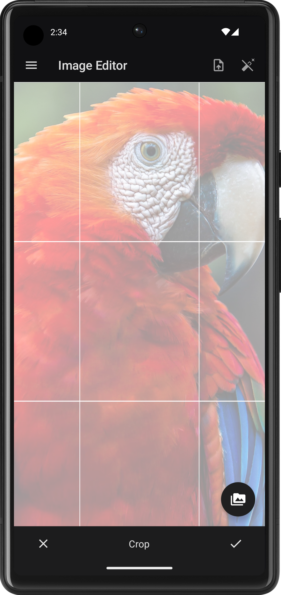
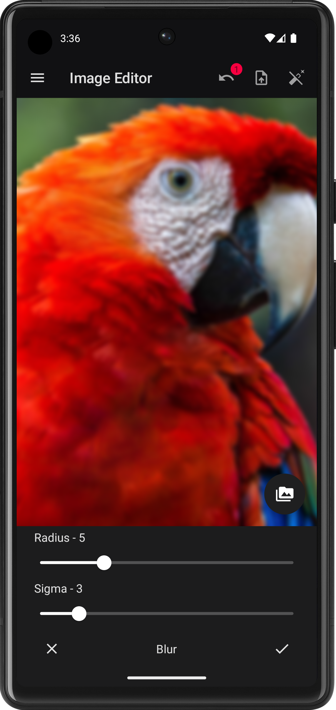

# OpenGL Photo Editor Showcase

This project was originally created to learn basics of OpenGL and build a simple and tiny photo editor app (less than 1 MB) on the top of
it.

Since it is educational project it might contain bugs, be unstable and not well tested. The project might be useful for
developers who are learning OpenGL basics, just like I do.

## Current Features

- Offscreen rendering
- Ping Pong texture rendering
- vertex/fragment shaders for creating visual effects
- Textures export
- Dark/light theme support

## Used Tools and Libraries

- [Jetpack Compose](https://developer.android.com/jetpack/compose) - for UI
- [TEA-Bag](https://github.com/Xlopec/Tea-bag) - for app architecture

## TODO Features

## Known Issues

- Image disappears after putting the app to background on some devices (at least on Meizu). Have no ideas yet on how to fix it. Looks like
  it's related to Compose somehow
